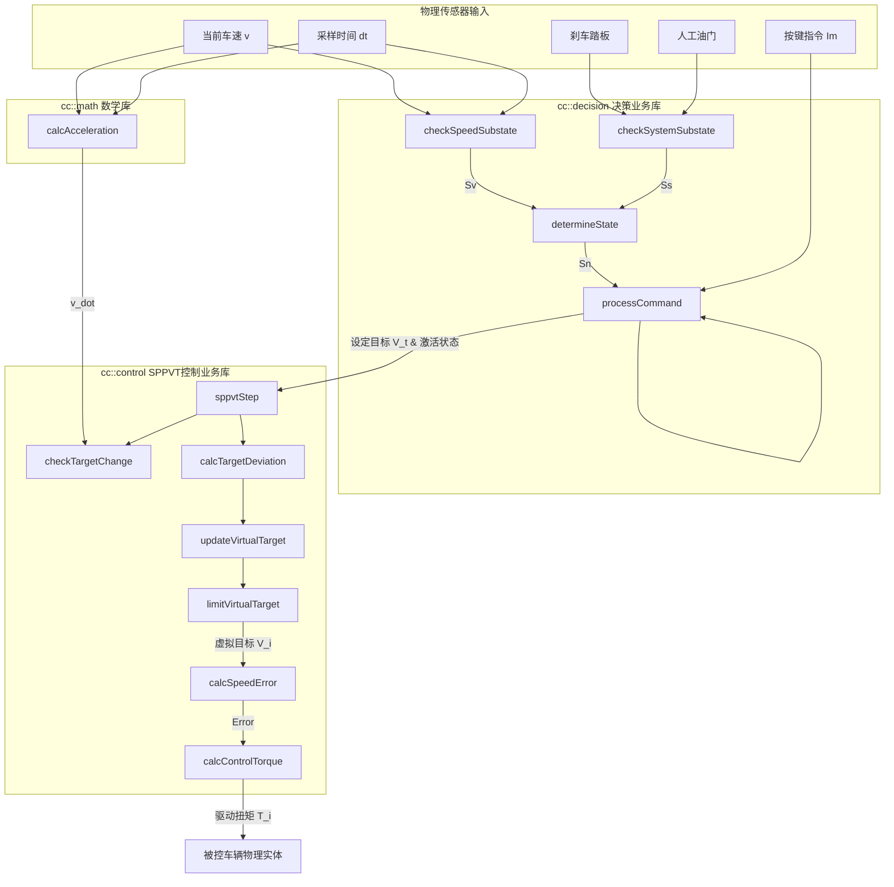

# 定速巡航（CC）系统设计原理与 C 风格面向过程实现文档

本仓库为定速巡航（CC）系统（决策逻辑与 SPPVT 变目标控制算法）的 C++ 面向过程工程化实现，旨在作为控制算法与业务逻辑分离的 C++ 教学示范项目。

---

## 一、 算法核心机理详解

定速巡航系统是一个典型的**人机共驾**系统。为了保证安全，系统在设计上必须遵循“人驾优先”的原则。本系统的算法设计主要包括**系统决策状态机**与**定速控制器（SPPVT 算法）**。

### 1.1 系统状态决策状态机

系统决策器通过采集车辆传感器的物理状态（车速、刹车踏板、人工油门）以及驾驶员的按键指令，通过模糊控制表决策出系统当前的动作行为。

#### 1.1.1 状态分类与二进制子态编码
系统状态 $S_n$（共 7 类，即 $S_0 \sim S_6$）由以下四个子状态共同决定：
1. **车速子态** ($S_{vi}$)：
   - 适速 ($S_{v0}$): 当前车速处于适控车速区间 $[v_{min}, v_{max}]$ 内。
   - 低速 ($S_{v1}$): 车速低于最低适控车速（欠速），即 $v(t) < v_{min}$。
   - 高速 ($S_{v2}$): 车速高于最高适控车速（超速），即 $v(t) > v_{max}$。
2. **系统子态集** ($S_{sj}$)：通过 3 个布尔量（位域）编码出 8 种组合，其十进制索引 $j$ 的计算表达式为：
   $$j = 4b_2 + 2b_1 + b_0 \quad (j \in [0, 7])$$
   - **控制子态 $b_2$**：`0` = 待命 (Standby), `1` = 在控 (Active)
   - **油门子态 $b_1$**：`0` = 无油 (No Throttle), `1` = 有油 (Throttle Override)
   - **目标子态 $b_0$**：`0` = 无史 (No saved target speed), `1` = 有史 (Has saved target speed)

其编码映射表如下（SYS_SUBSTATE）：
* `SYS_SUBSTATE_S0` ($j=0$, `000`): 待命无油无史
* `SYS_SUBSTATE_S1` ($j=1$, `001`): 待命无油有史 (支持 Resume)
* `SYS_SUBSTATE_S2` ($j=2$, `010`): 待命有油无史
* `SYS_SUBSTATE_S3` ($j=3$, `011`): 待命有油有史
* `SYS_SUBSTATE_S4` ($j=4$, `100`): 在控无油无史
* `SYS_SUBSTATE_S5` ($j=5$, `101`): 在控无油有史
* `SYS_SUBSTATE_S6` ($j=6$, `110`): 在控有油无史 (允许踩油门超越)
* `SYS_SUBSTATE_S7` ($j=7$, `111`): 在控有油有史

#### 1.1.2 系统状态判定表（表 6/10）
通过组合车速子态 $S_{vi}$ 与编码子态 $S_{sj}$，决策出当前的系统状态 $S_n$：

| 车速子态 \ 系统子态集 $S_{sj}$ | $S_{s0}$ (0) | $S_{s1}$ (1) | $S_{s2}$ (2) | $S_{s3}$ (3) | $S_{s4}$ (4) | $S_{s5}$ (5) | $S_{s6}$ (6) | $S_{s7}$ (7) |
| :--- | :---: | :---: | :---: | :---: | :---: | :---: | :---: | :---: |
| **$S_{v0}$ (适速)** | $S_3$ (无史待命) | $S_2$ (有史待命) | $S_4$ (有油待命) | $S_4$ (有油待命) | $S_0$ (适速在控) | $S_0$ (适速在控) | $S_0$ (适速在控) | $S_0$ (适速在控) |
| **$S_{v1}$ (低速)** | $S_5$ (非适速待命) | $S_5$ (非适速待命) | $S_5$ (非适速待命) | $S_5$ (非适速待命) | $S_6$ (低速在控) | $S_6$ (低速在控) | $S_6$ (低速在控) | $S_6$ (低速在控) |
| **$S_{v2}$ (高速)** | $S_5$ (非适速待命) | $S_5$ (非适速待命) | $S_5$ (非适速待命) | $S_5$ (非适速待命) | $S_1$ (高速在控) | $S_1$ (高速在控) | $S_1$ (高速在控) | $S_1$ (高速在控) |

#### 1.1.3 动作决策模糊矩阵与安全退出保护
系统根据当前状态 $S_n$ 和按键指令 $I_m$ 进行动作决策 $R_k$：
* **定量增减速 ($R_1, R_2$)**：在适速在控（$S_0$）下调整目标车速。
* **继承控制 ($R_4$)**：从有史待命（$S_2$）按增速键恢复到上次的历史巡航车速（Resume 逻辑）。
* **无继控制 ($R_5$)**：从无史待命（$S_3$）或油门待命（$S_4$）直接以当前车速开始巡航（Set 逻辑）。
* **安全紧急待命 ($R_6, R_7$)**：
  - **人驾干预**：任何状态下，刹车 $I_3$ 或取消 $I_2$ 均无条件退回待命。
  - **低速在控主动超时保护（本实现新增的安全性优化）**：若车辆由于上陡坡动力不足或受阻进入 $S_6$（低速在控）状态，若持续时间超过 $t_{timeout}$（本代码设为 $3.0\text{s}$），即使驾驶员未按下任何按键，系统也会**主动触发 $R_7$（报错待命）**并切断动力输出，以防电机/发动机在低速大负载下持续过载烧毁。

---

### 1.2 SPPVT（阶式惩罚型变目标比例控制）算法

#### 1.2.1 传统控制的局限与 SPPVT 设计思想
1. **经典 P 控制的稳态误差（静差）**：
   在车辆巡航控制中，比例控制律为 $T(t) = K_p (V_t - v(t))$。当存在恒定的行驶阻力（坡度阻力、风阻）$T_{res}$ 时，系统若要输出扭矩克服阻力，必须维持非零的控制偏差，即 $\Delta v_{ss} = T_{res} / K_p$，导致实际车速 $v$ 永远无法达到设定目标 $V_t$。
2. **PI 控制器的不足**：
   若引入积分控制（I）来消除静差，在大惯性、执行器存在扭矩饱和的车辆系统上，极易产生**积分饱和（Integrator Windup）**，导致爬坡后冲出坡顶时车速暴增超调、以及巡航过程发生速度振荡。
3. **SPPVT 阶式变目标的核心思想**：
   SPPVT 不引入连续积分器。当检测到车辆速度在当前级目标下已经平稳（加速度接近于 0）时，系统判定当前处于**变目标时刻 $t_i$**。此时计算车辆实际速度与最终最终目标速度的偏差 $\Delta V_{ti} = V_t - v_i(t_i)$，并以惩罚系数 $\rho$ 阶跃式地调高内部的“虚拟目标速度” $V_i$，通过增大比例项的误差输入，迫使执行器输出更大的扭矩来对抗行驶阻力，从而消除静差。

#### 1.2.2 算法收敛性严格数学证明
设车辆在第 $i$ 阶的目标更新过程中，在平稳点 $t_i$ 时的车速为 $v_i(t_i)$，其恒定行驶阻力折算为驱动扭矩需求为 $T_{res}$。

根据比例控制律，在平稳点处扭矩输出刚好与阻力平衡：
$$T_i(t_i) = K_p (V_i - v_i(t_i)) = T_{res}$$
从而可以得到当前级的稳态车速与内部虚拟目标的关系：
$$v_i(t_i) = V_i - \frac{T_{res}}{K_p} \tag{公式 A}$$

代入变目标车速更新公式：
$$V_{i+1} = V_i + \rho (V_t - v_i(t_i)) \tag{公式 B}$$

将公式 A 代入公式 B 中，消去 $v_i(t_i)$ 项：
$$V_{i+1} = V_i + \rho \left( V_t - \left( V_i - \frac{T_{res}}{K_p} \right) \right)$$
$$V_{i+1} = (1 - \rho) V_i + \rho \left( V_t + \frac{T_{res}}{K_p} \right) \tag{公式 C}$$

公式 C 是一个经典的**一阶线性常系数差分方程**。由于算法要求惩罚系数满足 $0 < \rho < 1$，因此比例因子 $(1 - \rho) \in (0, 1)$。
由差分方程理论可知，当阶数 $i \to \infty$ 时，该序列必收敛，其极限 $V_{\infty}$ 可通过令 $V_{\infty} = V_{i+1} = V_i$ 求解：
$$V_{\infty} = (1 - \rho) V_{\infty} + \rho \left( V_t + \frac{T_{res}}{K_p} \right)$$
$$\rho V_{\infty} = \rho \left( V_t + \frac{T_{res}}{K_p} \right)$$
$$V_{\infty} = V_t + \frac{T_{res}}{K_p} \tag{公式 D}$$

现在，我们将虚拟目标速度的稳态极限 $V_{\infty}$ 带入车辆平衡公式 A 中，求解车辆实际收敛的速度极限 $v_{\infty}$：
$$v_{\infty} = V_{\infty} - \frac{T_{res}}{K_p} = \left( V_t + \frac{T_{res}}{K_p} \right) - \frac{T_{res}}{K_p} = V_t$$

$$\lim_{i \to \infty} v_i(t_i) = V_t$$

**证明完毕**。这表明：**在任意恒定的外部行驶阻力下，只要经过若干步的虚拟目标阶跃调整，实际车速均能无超调地、渐进收敛至驾驶员最初设定的定速巡航目标 $V_t$。**

#### 1.2.3 算法四重防爆冲与稳定性机制
为解决原设计方案在工程实现上的安全性缺陷，本实现引入了以下防护机制：
1. **双边绝对值限幅判定条件**：
   变目标条件修改为 $|\dot{v}(t_i)| < \delta$。防止在车辆制动、下坡或受到扰动发生减速时（$\dot{v}$ 为负值），由于单边不等式 $\dot{v} < \delta$ 成立而错误地、高频地累加目标，造成系统失控。
2. **冷却锁存机制**：
   变目标更新触发后，启动冷却计时器 $T_{cooldown} \ge 2.0\text{s}$。在冷却期内禁止检测式，为动力执行机构响应新的扭矩命令留出过渡时间，避免阶数 $i$ 在稳态下高频盲目累加。
3. **抗积分饱和截断限制**：
   若车辆遇到无法克服的物理障碍（如陡坡过陡、严重超载致使电机堵转），限制虚拟目标最大超偏量：
   $$V_i \le V_t + V_{max\_offset} \quad (\text{本代码取 } V_{max\_offset} = 4.0\text{ m/s})$$
   防止虚拟速度无限累加，在阻力突减时引发危险暴冲。
4. **控制会话重置机制**：
   只要系统脱离控制（待命/退出）后重新进入控制，必须清空历史状态，强制重置：
   $$i \leftarrow 1, \quad V_1 \leftarrow V_t$$
   防止车辆继承上一次高负载工况下累加的高虚拟车速。

---

## 二、 C 语言风格面向过程 C++ 实现

本工程采用**纯面向过程的 C 语言开发风格**（仅使用命名空间和引用等少量 C++ 特性），不包含任何类定义。所有控制状态与配置均保存在独立的结构体中，以引用或指针参数的形式在底层算法函数之间流转，具备极高的代码灵活性、可复用性与教学示范价值。

### 2.1 目录结构与模块说明
```
cruiseControl/
├── bin/                       # 编译生成的可执行二进制文件目录
│   ├── test_decision          # 决策表与安全超时测试程序
│   ├── test_control           # SPPVT 控制算法独立测试程序
│   └── test_integration       # 联合车辆动力学的闭环仿真程序
├── output/                    # 运行及可视化输出目录
│   ├── simulation_results.csv # 仿真过程高频时序 CSV 数据
│   └── simulation_plot.png    # 仿真曲线可视化 PNG 图像
├── include/                   # 头文件目录
│   ├── math/                  # 共性数学库 (cc::math)
│   ├── decision/              # 决策业务库 (cc::decision)
│   └── control/               # SPPVT控制业务库 (cc::control)
├── src/                       # 源文件目录
│   ├── math/                  # 共性数学函数实现
│   ├── decision/              # 决策状态机业务实现
│   └── control/               # SPPVT控制逻辑业务实现
├── test/                      # 测试源文件目录
├── CMakeLists.txt             # 现代 CMake 构建脚本
├── plot_simulation.py         # 基于 Python 虚拟环境 (~/.ai-env) 的绘图工具
└── Readme.md                  # 说明文档
```

### 2.2 核心业务数据结构
```cpp
// 决策输入 (DecisionInput)
struct DecisionInput {
    double currentSpeed;         // 当前车速 (m/s)
    bool isBrakePressed;         // 刹车踩下标志
    bool isThrottlePressed;      // 油门踩下标志
    bool hasHistoryTarget;       // 存在历史巡航车速
    bool controlActive;          // 巡航是否处于激活状态
    DriverCommand driverCommand; // 按键指令
    double dt;                   // 周期步长 (s)
};

// SPPVT 控制输入 (SppvtInput)
struct SppvtInput {
    double currentSpeed;         // 当前实际车速 (m/s)
    double targetSpeed;          // 设定巡航车速 (m/s)
    double currentAcceleration;  // 数值微分加速度 (m/s^2)
    double dt;                   // 步长 (s)
    bool pauseControl;           // 暂停标志
    bool isNewControlSession;    // 会话重置标志
};
```

---

## 三、 函数调用拓扑与数据流图

系统在每个周期的运行过程可通过以下数据流及调用拓扑表示：



---

## 四、 编译与可视化运行指南

### 1. 编译代码
直接在项目根目录下通过系统 `clang++` 或 `g++` 编译，生成至 `bin/` 文件夹下：
```bash
clang++ -std=c++11 -Iinclude src/math/*.cpp src/decision/*.cpp src/control/*.cpp test/test_decision.cpp -o bin/test_decision
clang++ -std=c++11 -Iinclude src/math/*.cpp src/decision/*.cpp src/control/*.cpp test/test_control.cpp -o bin/test_control
clang++ -std=c++11 -Iinclude src/math/*.cpp src/decision/*.cpp src/control/*.cpp test/test_integration.cpp -o bin/test_integration
```

### 2. 运行单元测试
```bash
./bin/test_decision    # 验证决策状态机与超时安全策略
./bin/test_control     # 验证 SPPVT 核心控制方程式
```

### 3. 一键运行可视化仿真 (Python)
使用您系统专用的 `~/.ai-env` 环境直接运行可视化绘图脚本。该脚本会自动启动 C++ 物理仿真，读取高频采样数据并绘制高清仿真曲线保存到 `output/` 目录中：
```bash
./plot_simulation.py
```
运行后，可以打开 [output/simulation_plot.png](file:///Users/qingxu/Documents/Software/Cpp/cruiseControl/output/simulation_plot.png) 观察车速、虚拟目标在阻力坡度变化下的完美自适应收敛曲线。
